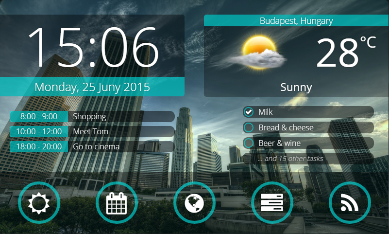
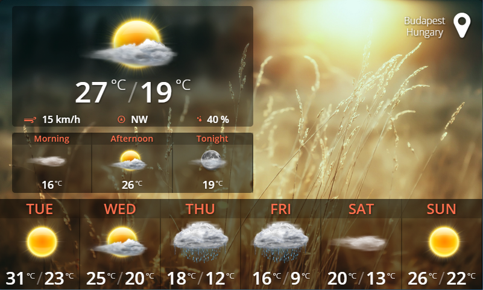
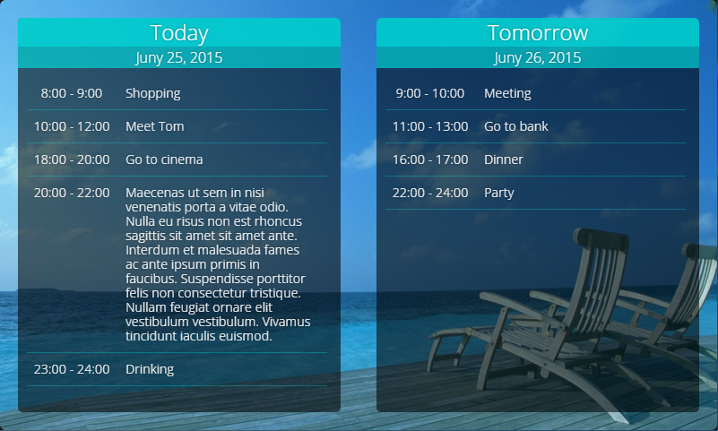
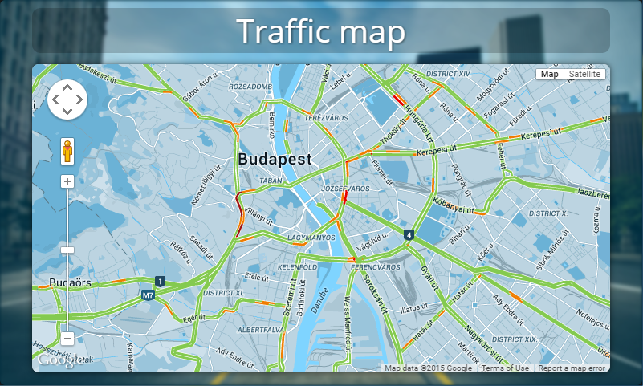
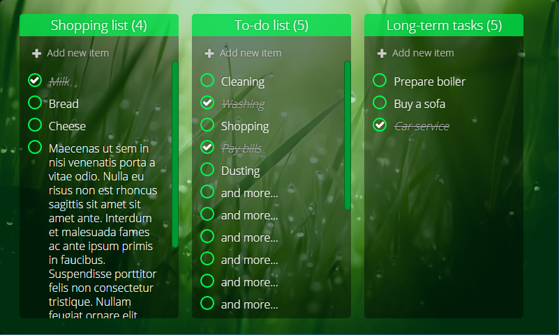
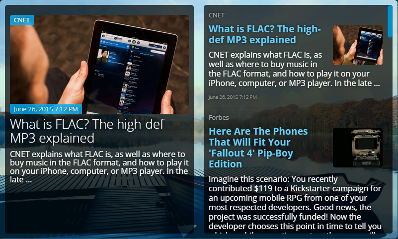

# Home Portal
It's a modularized & extendable home information portal for Raspberry PI (with LCD).

_It's a rewritten application of my early made private project._
https://youtu.be/-RMQ2eQlAQY

## Screenshots

### Home page

### Weather page

### Calendar page

### Map page

### Tasks page

### News page

# Contact

Copyright (C) 2020 Icebob

 