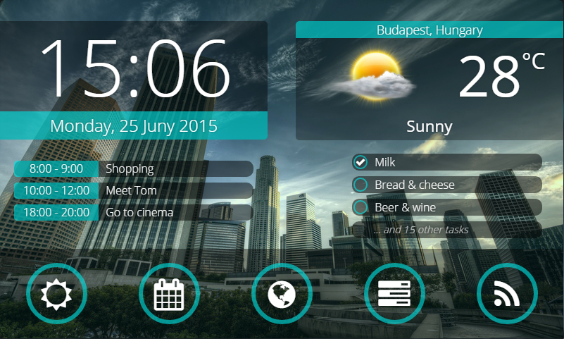
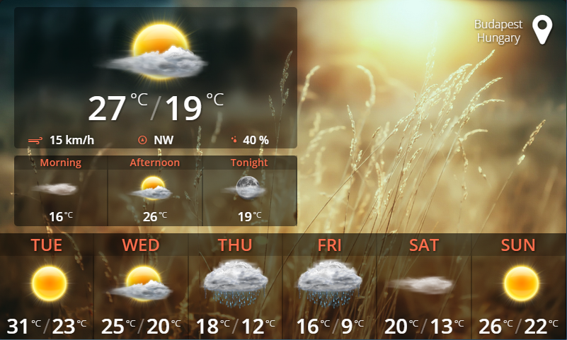
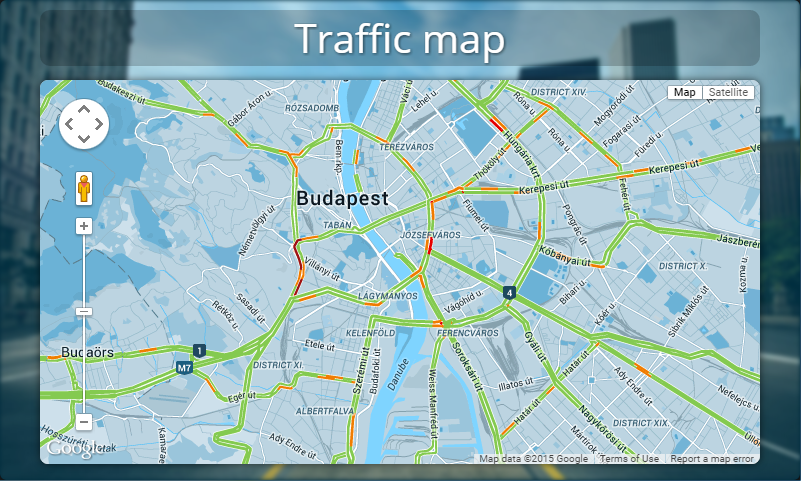
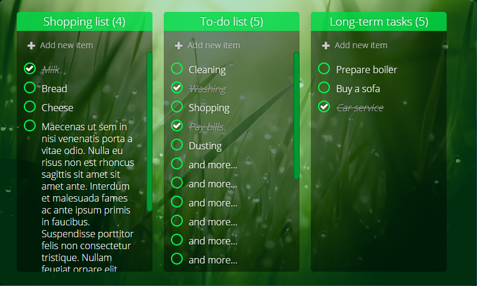
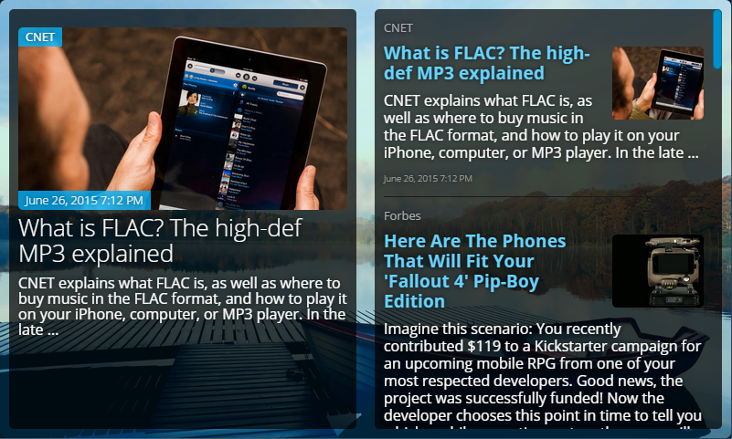

# Home Portal
It's a modularized & extendable home information portal for Raspberry PI (with LCD).

_It's a rewritten application of my early made private project._
https://youtu.be/-RMQ2eQlAQY

## Install
1. Setup a Raspberry PI 3/4 with an LCD display
2. Write the [official Raspberry OS](https://www.raspberrypi.org/software/operating-systems/) to an SD card with [Balena Etcher](https://www.balena.io/etcher/) or any SD flash software.
3. Configure internet access on your Raspberry PI.
4. Open a terminal and execute the following command:
    ```bash
    curl -Lo- https://cutt.ly/get-home-portal | bash
    ```
5. After restarting, the Home Portal application will start.

## Tech stack

- [Moleculer](https://moleculer.services/) on the backend. Every module is one or more services.
- Vue in the core frontend but the UI is based on [micro-frontends](https://micro-frontends.org/), so every module can use its favorite framework (Vue, React, Angular, Svelte...etc)

If you like the concept and would like to join to the project, please [contact me](https://icebob.info/).

## Screenshots

### Home page


### Weather page


### Calendar page


### Map page


### Tasks page


### News page


# Contact

Copyright (C) 2020 Icebob

[](https://github.com/icebob) [](https://twitter.com/Icebobcsi)
